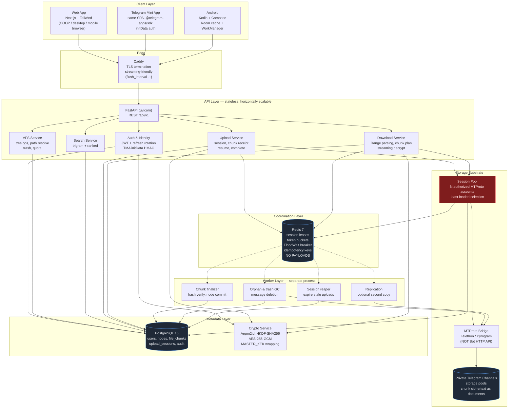
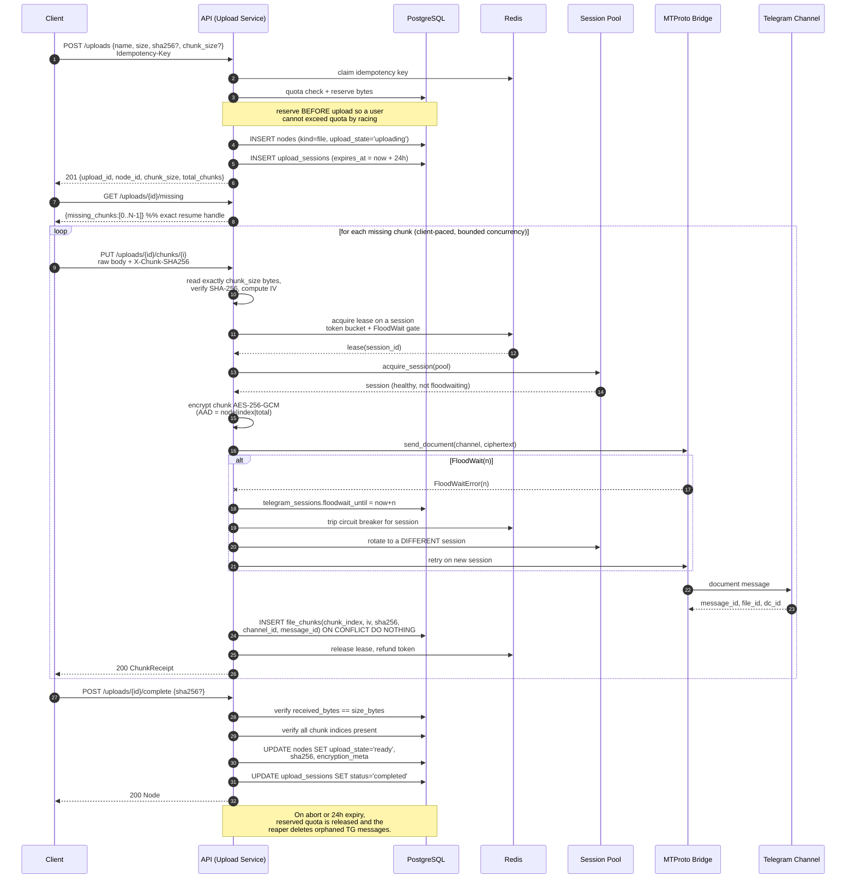
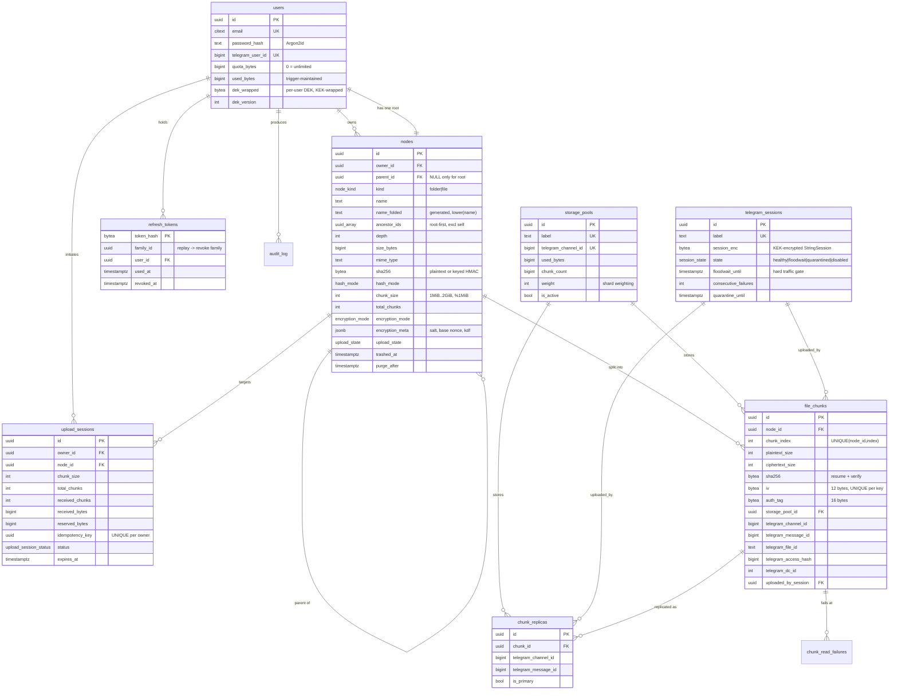

# TeleDrive — Architecture Blueprint

> **Status:** Design baseline v1.0
> **Scope:** System architecture, component model, upload/download data flow, storage substrate abstraction, and the PostgreSQL VFS schema.

---

## 1. Executive summary

TeleDrive is a personal cloud drive that stores **file payloads as encrypted chunks inside private Telegram channels**, reached over **MTProto** rather than the HTTP Bot API. A **PostgreSQL-backed Virtual File System (VFS)** supplies the hierarchy, metadata, and the chunk→message index that Telegram itself does not provide.

Three clients — responsive web, Telegram Mini App, and native Android — speak one **identical REST contract**, so the mobile clients share semantics rather than implementations.

### The two non-negotiable design constraints

Everything downstream follows from these:

| Constraint | Consequence for the architecture |
|---|---|
| **Telegram gives you opaque message IDs, not a filesystem.** There is no rename, no folder, no atomic move, no path. | The VFS *is* the database. Telegram is a dumb, durable, remote blob store. Every hierarchy operation is a Postgres transaction, and the chunk index is the only thing that makes the data recoverable. **Losing Postgres renders every stored byte unrecoverable ciphertext.** |
| **Telegram punishes aggressive clients with `FloodWait`, then with bans.** Limits are per-account *and* per-chat (~20 messages/min/chat). | Storage traffic must be **admitted** through a session pool + token buckets, never fired blindly. `FloodWait` is a **first-class scheduling signal**, not an exception to swallow. This constrains throughput far more than CPU or bandwidth does. |

### The core insight: one chunk = one Telegram message = one AEAD record

```
plaintext file ──▶ [chunk 0][chunk 1][chunk 2] ... [chunk N-1]
                        │         │         │            │
                        ▼         ▼         ▼            ▼
                   AES-256-GCM, unique IV per chunk, per-chunk tag
                        │         │         │            │
                        ▼         ▼         ▼            ▼
                   msg 101   msg 102   msg 103  ...  msg (100+N)
                        └─────────┬───────────────────────┘
                                  ▼
                    PostgreSQL: file_chunks(node_id, chunk_index)
                                → (channel_id, message_id, iv, sha256)
```

Three properties fall out of this decomposition, and they are the reason the design holds together:

1. **Chunks are independently addressable.** Random access becomes a *seek into the chunk array* — no need to read a linear stream from the start. This is what makes HTTP `Range` requests and video scrubbing possible at all.
2. **Uploads are naturally resumable and parallel.** The unit of work is a chunk, and the client can ask `GET /uploads/{id}/missing` to learn exactly which indices the server already holds. Resume is exact, not approximate.
3. **Encryption is per-chunk and authenticated.** AES-GCM needs a unique IV per key; giving each chunk its own IV *and* its own GCM tag means a corrupted or truncated chunk is detected at the chunk boundary, in the right place, instead of silently corrupting the whole file. It also means chunks can be re-uploaded independently without disturbing their neighbours.

The trade off accepted here: a wrong chunk ordering produces a valid-looking-but-scrambled file. That is handled by binding `chunk_index`, `node_id`, and `total_chunks` into the GCM **associated data**, so a reordered chunk fails authentication rather than decrypting into garbage.

---

## 2. Component architecture



### Why the worker layer is a separate process

Chunk finalization (whole-file hash verification), trash purging, and orphan garbage collection are **long, bursty, and Telegram-rate-limited**. If they shared a process with the API, a GC run that has to delete 5,000 messages would consume the same event loop and the same session-pool slots that interactive downloads need. Splitting them means:

- The API scales on request latency; workers scale on queue depth.
- A worker crash cannot take down the request path.
- The worker can be given its own, *smaller* share of the session pool, so garbage collection can never starve user-facing reads.

### Why Postgres holds the primary chunk pointer (not `chunk_replicas`)

`file_chunks` carries the channel/message/IV columns **inline** even though `chunk_replicas` exists. This is deliberate denormalization for the hot path: a 10 GiB download at 64 MiB chunks joins 160 rows, and adding a second join per chunk on the largest table in the system is pure latency for zero benefit. `chunk_replicas` is the *optional extra copies* table — a chunk has exactly one primary location plus N optional replicas, and failover reads walk replicas only when the primary is known-bad.

---

## 3. Data flow — upload pipeline



### Upload design decisions worth defending

**The client slices; the server verifies.** The server never buffers more than one chunk, and the client's slicing is validated by requiring `Content-Length` to equal the expected chunk size (except the last) *and* by `X-Chunk-SHA256` matching the received bytes. A client that slices wrong is caught at the first bad chunk, not at `complete`.

**Chunks are addressed, not sequential streams.** The multipart-stream-everything approach was rejected: a single 2 GB multipart body cannot be resumed, cannot be parallelized, and pins a connection for minutes. Chunk-addressed PUTs make every chunk retryable in isolation.

**`ON CONFLICT DO NOTHING` on chunk insert gives free idempotency.** A client that retries a chunk after a network blip — the server actually stored it but the response was lost — gets a 200 receipt, not a duplicate message on Telegram. Re-uploading the *same index with a different hash* is a genuine conflict and returns 409.

**Quota is reserved up front, and released on abort.** Reserving at session creation prevents a race where two concurrent uploads both pass a quota check and together exceed the limit. The reservation is explicitly released on `DELETE /uploads/{id}`, on expiry, and on permanent failure.

**Memory ceiling.** Chunks are buffered in RAM, never written to disk, which is what makes "no server disk for large files" true. The operational consequence is hard and must be respected: the API container needs roughly `MAX_CONCURRENT_UPLOADS × chunk_size` bytes of headroom plus overhead. At 64 MiB chunks and 8 concurrent uploads that is ~512 MiB minimum. Raising `STORAGE_CHUNK_SIZE_BYTES` without raising the memory limit will OOM-kill the container.

---

## 4. Data flow — download and Range streaming

```mermaid
sequenceDiagram
    autonumber
    participant C as Client / <video> tag
    participant A as API (Download Service)
    participant PG as PostgreSQL
    participant P as Session Pool
    participant T as MTProto Bridge
    participant TG as Telegram

    C->>A: GET /nodes/{id}/content<br/>Range: bytes=1000000-3000000
    A->>PG: SELECT node (owner check, chunk_size,<br/>sha256, total_chunks)
    A->>A: verify ownership; 404 if not owner
    alt If-None-Match matches ETag
        A-->>C: 304 Not Modified
    end
    A->>A: plan read window:<br/>clamp to [0, size-1], else 416
    A->>A: map byte range -> chunk indices<br/>first_chunk = start // chunk_size
    Note over A: MTProto reads align to 4 KiB,<br/>so the first chunk's offset is<br/>rounded DOWN and trimmed in-process
    A->>PG: SELECT chunks WHERE node_id=?<br/>AND chunk_index BETWEEN ? AND ?<br/>ORDER BY chunk_index
    A-->>C: 206 Partial Content<br/>Content-Range, Accept-Ranges, ETag

    loop for each chunk in window
        A->>P: acquire_session(allow replica failover)
        P-->>A: session
        A->>T: iter_download(media, offset=aligned, limit=...)
        T->>TG: MTProto upload.getFile
        TG-->>T: ciphertext bytes
        T-->>A: stream (yield per 1 MiB, never fully buffered)
        A->>A: decrypt AES-256-GCM, verify tag
        alt tag mismatch
            A->>PG: try chunk_replicas
            A->>A: if none readable -> 502 chunk_unreadable
        end
        A->>A: trim leading/trailing bytes for<br/>first and last chunk only
        A-->>C: yield plaintext octets
    end

    Note over A,C: Response streams with no server-side<br/>temp file and no full-file buffer.<br/>Backpressure from the socket<br/>stops the MTProto read loop,<br/>so a slow client cannot exhaust RAM.
```

### Why Range support is the hard part, and how it is made honest

Telegram's `upload.getFile` retrieves **4 KiB-aligned offsets**. A request for `bytes=1000000-3000000` cannot be served by asking Telegram for offset 1,000,000. Two strategies exist, and the design uses both:

- **The cheap path (used here): chunk-granular fetching.** Fetch the whole chunk containing the start offset, decrypt it, and discard the unwanted prefix. At 64 MiB chunks the waste is bounded by one chunk per request — acceptable, and it keeps the implementation small and correct.
- **The optimized path (documented, not enabled by default): 4 KiB-aligned sub-chunk reads.** Round the offset *down* to a 4 KiB boundary, read forward, and trim. This is much cheaper for many small `Range` requests (e.g. an audio player issuing a flurry of tiny seek reads) at the cost of more MTProto round-trips, which is exactly the resource that gets accounts rate-limited and banned.

**This is a real trade-off, stated plainly:** the default favours *fewer Telegram requests* (ban safety) over *minimum bytes transferred*. For a personal drive this is correct. A deployment with heavy media seeking should shard more aggressively across pools before tuning this knob.

**Backpressure is the safety property.** Because the response is a generator, the socket's write buffer governs how fast the MTProto read loop is drained. A client that stops reading stalls the generator rather than filling server memory. This is why the download path streams per 1 MiB sub-read rather than accumulating a chunk.

**Chunk ordering is authenticated, not assumed.** AAD binds `node_id ‖ chunk_index ‖ total_chunks`, so the failover and parallel-fetch paths cannot silently reassemble a file in the wrong order.

---

## 5. Entity-relationship diagram



### Schema decisions and the alternatives rejected

**Adjacency list + materialised `ancestor_ids` array (chosen).** Pure adjacency list makes breadcrumbs and subtree scans recursive, and recursive CTEs on every listing call do not scale. A full `ltree`/materialised-path column was the main alternative: excellent for prefix queries, but every move rewrites the path of the whole subtree *and* paths embed mutable user-supplied names, which makes renames expensive and path length a liability. The array keeps the tree mutable and cheap: moves rewrite one array per descendant, and both breadcrumbs (`id = ANY(ancestor_ids)`) and subtrees (`ancestor_ids @> ARRAY[id]`) are GIN-indexed.

**`NULLS NOT DISTINCT` on the sibling uniqueness index (PostgreSQL 15+).** This is the elegant trick that makes one root per user work with a single index: root nodes have `parent_id IS NULL`, and under default NULL semantics two roots would not conflict. With `NULLS NOT DISTINCT` they do, so `UNIQUE (owner_id, parent_id, name_folded)` enforces "no two live siblings share a name" *and* "exactly one root" simultaneously. On PostgreSQL 14 this must be replaced with a partial unique index on `(owner_id) WHERE parent_id IS NULL`.

**Digest is mode-dependent (`hash_mode`).** Storing a plaintext SHA-256 in `zero_knowledge` mode is a real leak: it is a confirmation oracle (an attacker who guesses content can verify it) and it enables dedup-based side channels. ZK uploads therefore store a **client-keyed HMAC** instead, so the column still powers integrity comparison without revealing plaintext identity. This is a subtle point that naive designs get wrong.

**`encryption_meta` as JSONB, not columns.** The non-secret crypto parameters (KDF name, salt, base nonce, key version, AAD version) evolve. JSONB lets a v2 cipher ship without a migration, while `dek_version` and `crypto_version` remain typed columns because they gate correctness.

**Trash is a timestamp, not a table.** `trashed_at` + `purge_after` + a cascading trigger means restore is exact (the subtree is marked uniformly) and quota is released the moment a file is trashed, since only live nodes count.

**`file_chunks.ciphertext_size >= plaintext_size` as a CHECK.** GCM adds a 16-byte tag; this constraint catches a class of bug where a ciphertext size is recorded incorrectly, which would corrupt Range math.

**`chunk_read_failures` exists so dead messages are learned once.** Without it, a deleted Telegram message produces a retry storm on every download attempt. With it, the downloader marks the primary bad and fails over to a replica immediately.

---

## 6. Security model

### Key hierarchy

```
MASTER_KEK (env, 32 bytes, never in DB)
   │
   ├─ wraps ─▶ users.dek_wrapped            (per-user Data Encryption Key)
   │              │
   │              ─ HKDF-SHA256(dek, salt=node_id, info="teledrive/file/v1")
   │                     │
   │                     └─▶ per-file key ─▶ AES-256-GCM per chunk
   │                                            IV: unique 12 bytes per chunk
   │                                            AAD: node_id ‖ chunk_index ‖ total_chunks
   │
   └─ encrypts ─▶ telegram_sessions.session_enc  (MTProto StringSession at rest)
```

Reasoning:
- **The KEK lives only in the environment.** Compromising the database alone yields no plaintext — the wrapped DEKs are useless without the KEK. Compromising the KEK yields everything, so it belongs in a secret manager, not a config file, and rotation is designed for via `dek_version`.
- **A per-user DEK bounds blast radius.** One user's key compromise does not expose another's data, and account deletion is a single key destruction.
- **Per-file keys via HKDF, derived from the DEK and bound to the node id.** No per-file key material needs storing, yet files are cryptographically isolated from each other.
- **The session pool is the crown jewel.** A Telegram `StringSession` is equivalent to a logged-in device. It is encrypted with the KEK, never logged, and never exposed through any API.

### Authentication

| Client | Mechanism |
|---|---|
| Web | Email + Argon2id password → JWT access (~15 min) + opaque rotating refresh (~30 days) |
| Telegram Mini App | `initData` HMAC-SHA256 validation against `HMAC-SHA256("WebAppData", bot_token)`, plus a freshness window |
| Android | Same JWT flow; refresh token stored in `EncryptedSharedPreferences` / Keystore |

**Refresh tokens are hashed in the database and grouped into families.** Presenting a token that has already been rotated (`used_at IS NOT NULL`) means the token was stolen and replayed — the entire family is revoked. This is why `refresh_tokens` stores `family_id` and `replaced_by` rather than a simple flag.

### Threats explicitly addressed

| Threat | Mitigation |
|---|---|
| Telegram/telecom operator reads stored data | AES-256-GCM before the payload leaves the process; Telegram stores only ciphertext |
| Chunk reordering or substitution | `chunk_index`/`node_id`/`total_chunks` bound into GCM AAD |
| Truncated or corrupted chunk | Per-chunk GCM tag; failure localized to one chunk, then replica failover |
| Cross-tenant data access | Every query is owner-scoped; `nodes_before_write()` rejects a parent owned by another user at the database level |
| IDOR on node/chunk endpoints | Ownership verified in the query, not after fetching |
| Quota bypass by racing uploads | Reservation at session creation + `SELECT … FOR UPDATE` on the user row during accounting |
| Stolen refresh token replay | Token families with rotation reuse detection |
| Database-only compromise | Wrapped DEKs — useless without the env-resident KEK |
| Telegram account ban as a data-availability attack | Session pool with quarantine, replicas, and read failover |
| Malicious Mini App `initData` | HMAC validation with constant-time comparison and an expiry window |

### What is deliberately *not* claimed

The `server_managed` mode is **not** zero-knowledge: the server can derive per-file keys, which is what enables server-side thumbnails and previews. Users who want true zero-knowledge select `zero_knowledge` mode, where the client supplies `X-Chunk-IV` and holds the key — and in exchange, **server-side previews and server-side whole-file hashing are unavailable**, because the server cannot read the bytes. This trade-off is exposed as an explicit per-upload choice rather than being quietly decided for the user.

---

## 7. Scaling and failure behaviour

| Dimension | Approach | Ceiling and honest limit |
|---|---|---|
| API | Stateless; scale horizontally behind Caddy | Bounded by Postgres connections, not CPU |
| Chunk throughput | Bounded concurrency per session + token bucket | **Hard-capped by Telegram per-chat ≈20 msg/min.** More chunks ≈ more messages; the fix is *more pools*, not more parallelism |
| Storage capacity | Private channels as shardable pools | Effectively unbounded, but **deletion is the only reclamation** and is itself rate-limited |
| Metadata | Postgres; partition `file_chunks` by `node_id` hash beyond ~500M rows | Single-writer bottleneck for quota accounting, mitigated by per-user row locking |
| Session pool | Least-loaded selection + circuit breaker | Per-account limits dominate; pool size is derived from target throughput, see the ban-avoidance guide |
| Downloads | Generator streaming, no disk, no full buffer | Backpressure from the client socket |
| GC / trash purge | Lease-based `background_jobs` with `SKIP LOCKED` | Slow by design — it shares the same rate limits as uploads |

**Failure modes and their behaviour:**

- **A session starts FloodWaiting** → it is gated to `floodwait_until`, the circuit breaker trips, and traffic rotates to a healthy session. It rejoins the pool automatically after the wait.
- **A session is banned/revoked** → the operator quarantines it; `state='quarantined'` removes it from selection. Reads fail over to replicas.
- **A Telegram message is deleted out of band** → `chunk_read_failures` records it, the downloader tries replicas, and the file is marked degraded rather than failing opaquely.
- **Postgres is lost** → all chunks become unrecoverable ciphertext. **This is the single most important operational fact about the system** and drives the backup cadence in the operations guide.
- **Redis is lost** → degraded performance (leases and buckets rebuild, idempotency keys are lost so a retried `POST /uploads` may create a duplicate session) but **no data loss**, because Postgres remains the durable source of truth. This is precisely why Redis holds no payloads and no authoritative metadata.

---

## 8. Key design decisions, summarized

| # | Decision | Chosen | Rejected alternative | Why |
|---|---|---|---|---|
| 1 | Transport | MTProto (Telethon) | HTTP Bot API | Bot API enforces strict upload/download size limits and cannot stream ranges |
| 2 | Chunk identity | One chunk = one message = one AEAD record | One giant message; one linear stream | Enables random access, exact resume, parallel transfer, localized corruption |
| 3 | Hierarchy | Postgres adjacency list + materialised ancestor array | `ltree`; recursive CTEs on every call | Mutable renames cheap; breadcrumbs and subtrees GIN-indexed |
| 4 | Upload unit | Chunk-addressed `PUT` | Single resumable multipart body | Isolated retry; parallelism; no minute-long pinned connection |
| 5 | Encryption | AES-256-GCM, per-chunk IV, AAD-bound index | CBC+HMAC; whole-file GCM | Single-pass AEAD; ordering authenticated; no nonce reuse across chunks |
| 6 | Key derivation | KEK → per-user DEK → HKDF per file | One global key; store a key per file | Blast-radius containment with no per-file key material stored |
| 7 | Range reads | Chunk-granular (default) with documented 4 KiB path | Always 4 KiB-aligned | Fewer Telegram requests = lower ban risk, which dominates |
| 8 | Rate limiting | Session pool + token bucket + circuit breaker | Blind retry with backoff | FloodWait is a scheduling signal; ignoring it escalates to bans |
| 9 | Primary chunk pointer | Denormalized on `file_chunks` | Always join `chunk_replicas` | Saves one join per chunk on the largest, hottest table |
| 10 | GC queue | Postgres lease + `SKIP LOCKED`, Redis for speed | Redis-only queue | Survives a Redis flush without leaking orphaned Telegram messages |
| 11 | Trash | Timestamp + cascading trigger | Separate trash table | Exact subtree restore; quota released immediately |
| 12 | ZK digests | Keyed HMAC | Plaintext SHA-256 | Avoids a content-confirmation oracle in zero-knowledge mode |

---

## 9. Document map

| Document | Contents |
|---|---|
| `docs/01-architecture-blueprint.md` | This document |
| `db/migrations/0001_init.sql` | Full PostgreSQL DDL: tables, indexes, constraints |
| `db/migrations/0002_functions.sql` | Tree integrity, quota, trash cascade, search, job leasing |
| `docs/openapi.yaml` | OpenAPI 3.1 specification for the whole REST surface |
| `docs/04-android-workmanager-spec.md` | Kotlin/WorkManager background transfer engine |
| `docs/05-operational-guide.md` | Docker Compose, backup/DR, monitoring, runbook |
| `docs/06-telegram-ban-avoidance.md` | Session-pool sizing, FloodWait discipline, ban avoidance |
| `backend/` | FastAPI prototype: crypto, MTProto bridge, streaming services |